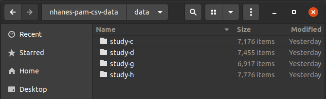

# nhanes-pam-csv-data

Original [NHANES](https://wwwn.cdc.gov/nchs/nhanes/) Physical Activity Monitoring (PAM) data in CSV format, one file per person with no data modifications.

## Data source

Centers for Disease Control and Prevention (CDC). National Center for Health Statistics (NCHS). National Health and Nutrition Examination Survey Data. Hyattsville, MD: U.S. Department of Health and Human Services, Centers for Disease Control and Prevention, 2003 - 2021, https://wwwn.cdc.gov/nchs/nhanes/.

Physical activity monitoring data only. The following table lists NHANES studies that contained PAM monitoring data:


| Study code name | Years       | Source                                                                               | Number of subjects |
|-----------------|-------------|--------------------------------------------------------------------------------------|--------------------|
| C               | 2003 - 2004 | [NHANES](https://wwwn.cdc.gov/nchs/nhanes/continuousnhanes/default.aspx?BeginYear=2003) | 7176               |
| D               | 2005 - 2006 | [NHANES](https://wwwn.cdc.gov/nchs/nhanes/continuousnhanes/default.aspx?BeginYear=2005) | 7455               |
| G               | 2011 - 2012 | [NHANES](https://wwwn.cdc.gov/nchs/nhanes/continuousnhanes/default.aspx?BeginYear=2011) | 6917               |
| H               | 2013 - 2014 | [NHANES](https://wwwn.cdc.gov/nchs/nhanes/continuousnhanes/default.aspx?BeginYear=2013) | 7776               |

In total, 29324 participants.

## Data processing

Original data was downloaded from the NHANES website in the `.xpt` or `.xpt.zip` formats. If compressed the data was decompressed using [unzip](https://linux.die.net/man/1/unzip). Then `.xpt` files were converted into corresponding `.csv` files using [r-project](https://cran.r-project.org) and [foreign package](https://cran.r-project.org/web/packages/foreign/index.html). This resulted in one large `.csv` file per NHANES study. Finally, the large `.csv` files containing all records for that study was split into multiple `.csv` files using [nhanes-csv-split](https://github.com/o-mdr/pa-pattern-complexity/tree/main/src/nhanes-csv-split) application.

This process is easy to repeat by following instructions in the [pa-pattern-complexity](https://github.com/o-mdr/pa-pattern-complexity) repository.

## Downloading data from git
Assuming you have `git`, `7zip`, and `sha256sum` these are the example commands to retrieve, check sha256 signatures, and decompress data

```bash
git clone https://github.com/o-mdr/nhanes-pam-csv-data.git
cd nhanes-pam-csv-data

# Validate checksum for 7z files
(cd 7z-data && sha256sum -c sha256sum.txt)

# Extract data
7z -bt x 7z-data/data.7z.001

# Check the number of files
[ $(find data/ -type f | wc -l) == 29324 ] && echo "Number of files verified: OK"
```


## Uploading to git
For faster upload/download multiple small csv files were re-compressed using cross-platform 7zip LZMA level 7 algorithm. Output archive split into files of ~90 MB to allow for smaller and free file uploads to github (files larger than 100 MB aren't allowed with free accounts, checked in October 2021).

```bash
# sudo apt-get install p7zip-full

# -bt    show progress
# -mx7   default compression method, level 7 (out of 9)
# -v90m  split into chunks of ~90 MBs
# a      archive name
7z -bt -mx7 -v90m a data.7z data/

# Generate checksum
cd 7z-data
rm sha256sum.txt
for f in *7z*; do sha256sum "$f" >> sha256sum.txt; done
cd ..

# push to git
./git-push-7z-data
```

## Licence

This repository is licensed under the [Unlicense](LICENCE) and it is compatible with public domain.
[Original data](https://wwwn.cdc.gov/nchs/nhanes/NhanesCitation.aspx) is in the public domain.
